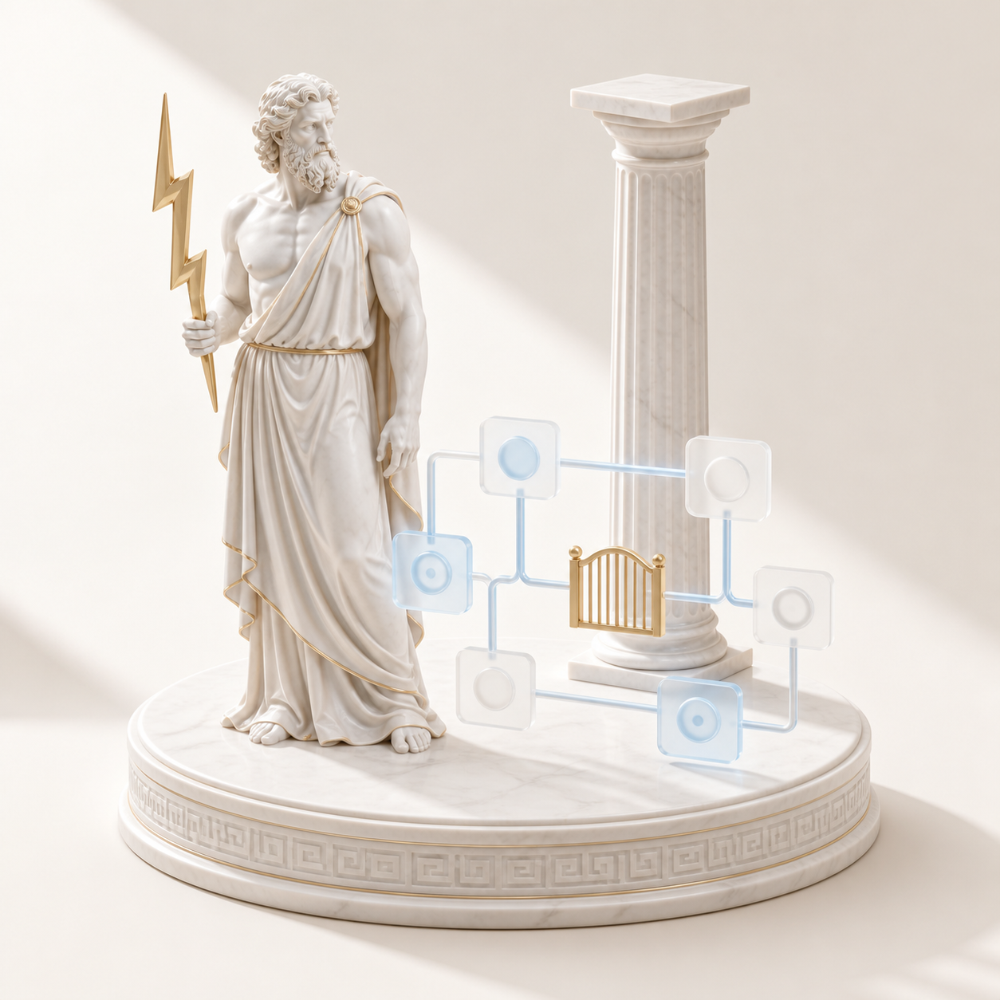

> Long-form reference kept from the previous README. The short beginner page lives in [README.md](../README.md).

# Zeuz

Zeuz is a workflow factory for agent harnesses. Given a complete specification, it asks a sequence of specialist agents to design, write, and inspect a new multi-agent workflow system.

[Quickstart](#quickstart) · [Example](#example-run) · [Security](#security-and-privacy) · [Contributing](../CONTRIBUTING.md) · [Русский](../README.ru.md)

<p align="center">
  
</p>


> Current status: reference implementation. The repository includes the workflow source, agent prompts, design rules, and a static smoke test. It does not include a standalone runner or a full end-to-end fixture.

## Quickstart

Requirements: Bash and Node.js.

```bash
git clone https://github.com/zarubinvibe/zeuz.git
cd zeuz
bash smoke/smoke.sh
```

The final line should be:

```text
ГЕЙТ ПРОЙДЕН ✓
```

That result proves that Node can parse the workflow inside its async wrapper and that the factory source still contains the required observability, DAG, context-gate, schema, agent, and repository-layout markers. It does not run the specialist agents.

## Run it in a host

`workflows/zeuz-pipeline.js` expects a workflow host that provides `args`, `phase()`, `agent()`, and `log()`. The host must also support structured agent output through the `schema` option.

Point Zeuz at the checkout and choose a parent directory for generated projects:

```bash
export ZEUZ_HOME="$PWD"
export ZEUZ_PROJECTS="$PWD/../zeuz-output"
```

Register `workflows/zeuz-pipeline.js` with the host, then invoke it with a complete specification:

```js
Workflow({
  name: 'zeuz-pipeline',
  args: `
Goal: build a workflow that reviews release notes before publication.
Input: Markdown files, up to 50 per run.
Completeness invariant: every input file has a recorded verdict.
Constraints: no publication without approval; keep an audit trail.
Done when: the ledger contains one verdict for every input file.
  `.trim(),
})
```

The pipeline rejects a missing or very short specification. The interactive `/grill-me` step named in the agent instructions belongs to the host setup and is not shipped in this repository.

## Example run

The workflow moves through these phases:

| Phase | What the checked-in source asks the agent to produce |
|---|---|
| Observe | A local runtime snapshot in `runs/_observability.jsonl`; `abtop` is optional |
| Cast | Role definitions and verified scientist personas |
| Architect | Stages, parallel boundaries, deterministic gate requirements, and a graph |
| Economize | A model map and context-saving measures for each stage |
| Build | Agent files, a workflow, a protocol, `CLAUDE.md`, and a plan DAG |
| Test | Syntax, gate, observability, lineage, persona, and dry-run findings plus a verdict |

Generated files go under `ZEUZ_PROJECTS/<system-slug>/`. The exact list requested by the build prompt is:

```text
agents/<scientist-slug>.md
<system-slug>-pipeline.js
PROTOCOL-<system-slug>.md
CLAUDE.md
runs/<run-id>-plan.dag.json
```

The final return value uses `status: "done"` only when the tester returns the verdict `ГОТОВА`. Other verdicts return `status: "needs_fix"` with the reported issues.

## Gates and evidence

The architect and builder prompts require generated workflows to protect irreversible actions with deterministic checks. The tester prompt inspects those checks before returning a verdict. The factory's own smoke test is narrower: it checks source syntax and invariant markers with `node --check`, file checks, and fixed-string searches.

For reviewable evidence, keep the generated project in a separate directory, inspect its files, and run its own tests before allowing publish, archive, move, or deployment actions.

## Security and privacy

- File access: build agents are instructed to write under `ZEUZ_PROJECTS`; observability writes under `ZEUZ_HOME/runs`.
- Shell access: the Observe and Test prompts invoke local commands. The host decides sandboxing and approvals.
- Network access: the Cast prompt asks the host to verify biographical facts on the web. Zeuz does not configure network policy.
- Secrets: the repository needs no credentials. Do not place secrets in specifications or generated artifacts.
- Telemetry: Zeuz contains no remote telemetry client. Runtime snapshots are local JSONL files.
- Approvals: the repository describes approval gates but cannot enforce host permissions by itself.
- Rollback: Zeuz does not undo generated writes. Use an isolated output directory and review the diff before accepting it.

See [SECURITY.md](../SECURITY.md) for the trust boundary and reporting guidance.

## Project map

| Path | Purpose |
|---|---|
| `workflows/zeuz-pipeline.js` | Executable workflow source for a compatible host |
| `agents/` | Prompts for the controller and six specialist roles |
| `rules/best-practices.md` | Repository-local construction policy passed to agents |
| `specs/00-roadmap.md` | Phase map and role ownership |
| `docs/decisions/` | Architecture decision records |
| `smoke/smoke.sh` | Static syntax and invariant check |
| `CLAUDE.md` | Project router for compatible coding-agent sessions |

## Status and limits

Zeuz is a reference implementation, not a packaged CLI or SDK. No public release schedule is committed.

- The repository has no bundled workflow host adapter.
- The smoke test does not execute a complete generated system.
- Model labels such as `haiku`, `sonnet`, and `opus` must be understood or mapped by the host.
- Agent verdicts remain model output. Treat generated code and claims as untrusted until independent checks pass.
- `abtop` is optional; the Observe step records `abtop_unavailable` when it cannot run the binary.


## Contributing

Read [CONTRIBUTING.md](../CONTRIBUTING.md), keep changes scoped, and run:

```bash
bash smoke/smoke.sh
git diff --check
```

## Attribution and license

Zeuz was created by Philipp Zarubin. The original workflow structure, agent personas, and earlier repository artwork remain in the project history and tracked assets.

Licensed under the [MIT License](../LICENSE). Copyright (c) 2026 Philipp Zarubin.
